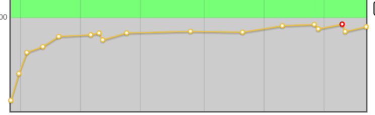
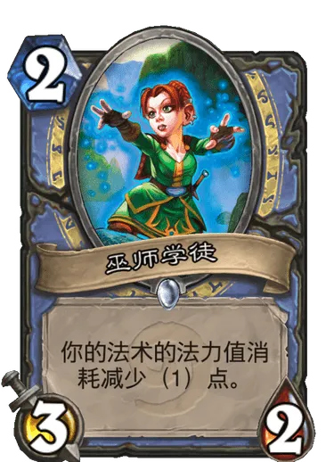

# 小萌新的AC梦

[学习记录](study.md) 

[补题计划](plan.md)

# 警告 所有内容不保证正确 

## 建立仓库原因

我开始学习算竞3个月了 感觉有点丧失当初那份**激情**了

codeforces 一直在 **1100** **起起伏伏**

那么 我或许应该换一种**学习方式**了 

那么 我来试一下打卡 吧 同时记些笔记啥的

仓库名就叫 小萌新的AC梦

来吧 看看你能**走多久**

因为 
>  **Every advantage has a beginning**

**right**?

# 总有一天我也会像你那么强

###  update 2026.1.27

我发现我还是没改掉不补题的坏习惯.....

所以添加了补题计划

希望不要越堆越多

所以 这是一个队列 我尽可能不要让他爆

###  update 2026.6.3

还是我 还是那个小萌新 上一次写记录仿佛就在昨天

我经历了很多 仿佛什么又没有经历

我觉得我真正患上了强迫症 我会自责 我会扣题 我会对着死活做不出来的题发狂

更可怕的是 最近头痛不断 对很多事情都打不起什么精神 我感觉自己就要完蛋了

所以我有点想淡化刷题这件事 但不在刷题的时候 想起自己糟糕的表现又很难受...... 训练量也骤降

那么 希望这些debuff 在**今天**结束!

我可能会把这个仓库作为一个小日记 记录自己的生活日常 讲述自己遇到好玩的题的趣事等等

加油啊 小萌新 你还记得那些吗

我知道你有很多过去不想面对 所以你才习惯把一切抛之脑后 你一直在逃避 一直在用幻想麻痹自己 

那么如何让未来不再重蹈覆辙呢

未来的小萌新啊 请告诉我吧

至少 今天的景色 很好看 不是吗

